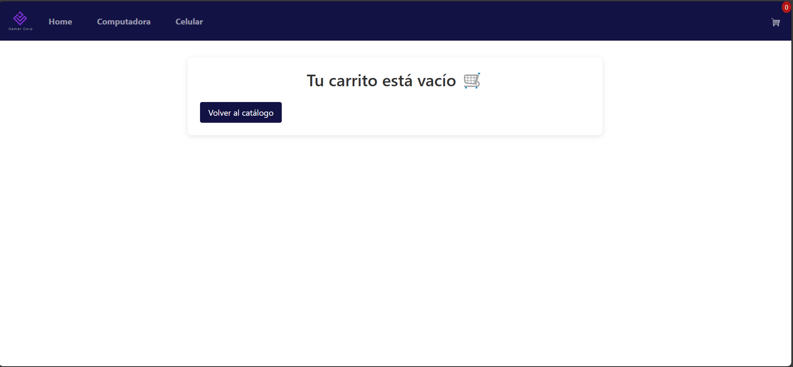
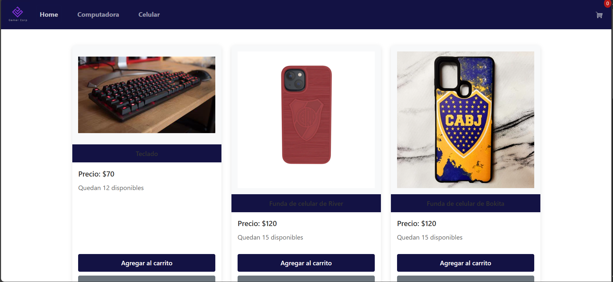
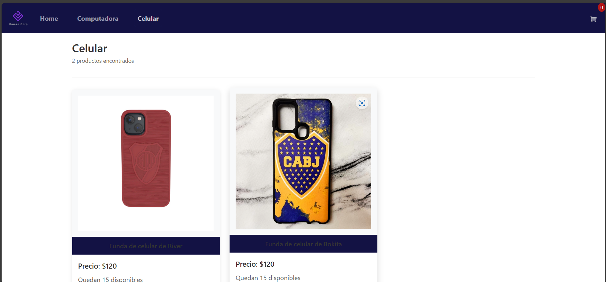
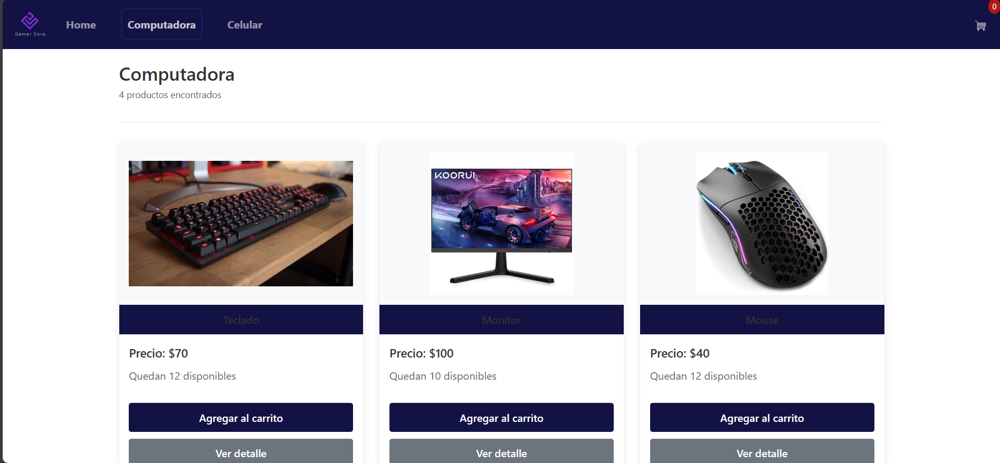

# 🛒 GamerCorp - E-commerce SPA en React

Este es un proyecto final para el curso de React JS de Coderhouse. Se trata de una tienda online ficticia de productos gamer, desarrollada como **Single Page Application** utilizando **React**, **Firebase**, **React Router DOM** y **Context API**.

## 🚀 Tecnologías y herramientas utilizadas

- ⚛️ React 19
- 🔥 Firebase (Firestore como base de datos)
- 🌐 React Router DOM para navegación
- 🎯 Context API para manejo global del carrito
- 💅 Bootstrap 5.3 para estilos y diseño responsive
- ☁️ Netlify para deploy

## 🧩 Funcionalidades

- ✅ Catálogo dinámico de productos desde Firebase
- ✅ Vista por categorías
- ✅ Detalle de producto con selector de cantidad
- ✅ Carrito de compras con resumen y total
- ✅ Checkout con formulario para finalizar la compra
- ✅ Persistencia en Firebase (orden guardada)

## 🔧 Cómo correrlo localmente
1. Clona el repositorio:
   git clone https://github.com/AmirKalasnicoy/proyectoReactJs
2. npm install
3. Crea un archivo .env con las variables de entorno
4. npm run dev

## 📸 Capturas
### Vista del carrito


### Página de inicio


### Productos para celulares


### Productos para computadora



## Deploy 🌍
El proyecto está desplegado en Netlify:
    https://react-proyect-amir.netlify.app

## Autor 💡
Amir Kalasnicoy
linkedin: https://www.linkedin.com/in/amir-012a35263-kalasnicoy/

## 🔧 Estructura del proyecto

```bash
├── src/
│   ├── components/
│   │   ├── Item, ItemDetail, Cart, Checkout, Navbar...
│   ├── context/
│   │   └── context.jsx 
│   ├── firebaseConfig.js
│   ├── App.jsx / main.jsx
│
├── public/
│   ├── _redirects (soporte para rutas en Netlify)
├── .env (variables para Firebase )
├── netlify.toml (configuración para despliegue)

